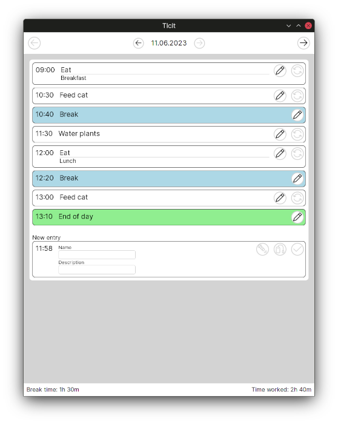
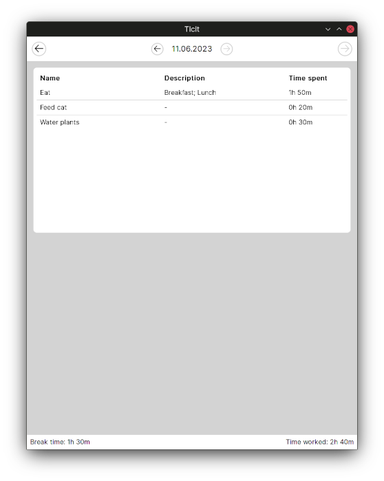

#  Ticit

Ticit is a simple timekeeping app build with Tauri and running on all operating systems.

## Installation

Find the latest release for your operating system [here](https://github.com/DustinHolm/ticit/releases/latest)
(Windows: ".exe", Linux: ".deb", OS X: ".dmg").

## Versioning

The app tries to apply SemVer to how the end user is affected.

- Patch version: Bugfix
- Minor version: New feature
- Major version: User might lose feature or may need to do something manually.

## Usage

Start new tasks. Take a break. Restart a previous task. At the end of the day check the summary of
tasks to see how much time you spend on what tasks.

    
    

## Contributing

If you find a bug, feel free to [open a bug at GitHub](https://github.com/DustinHolm/ticit/issues).

Feature requests _can_ be created via [an enhancement](https://github.com/DustinHolm/ticit/issues),
however I will most likely only work on requests that I want to see implemented myself. If you are
able and willing to work on the feature yourself, please note it in the issue.

Code contributions should only be made after I assign you to an issue. Just opening a pull request
(PR) might be ignored. PRs follow [GitHub flow](https://docs.github.com/en/get-started/quickstart/github-flow), although PRs get squashed, so the commit descriptions do not matter as much. Just write a nice PR
title and description.

## License

[The MIT License](https://opensource.org/licenses/MIT)
